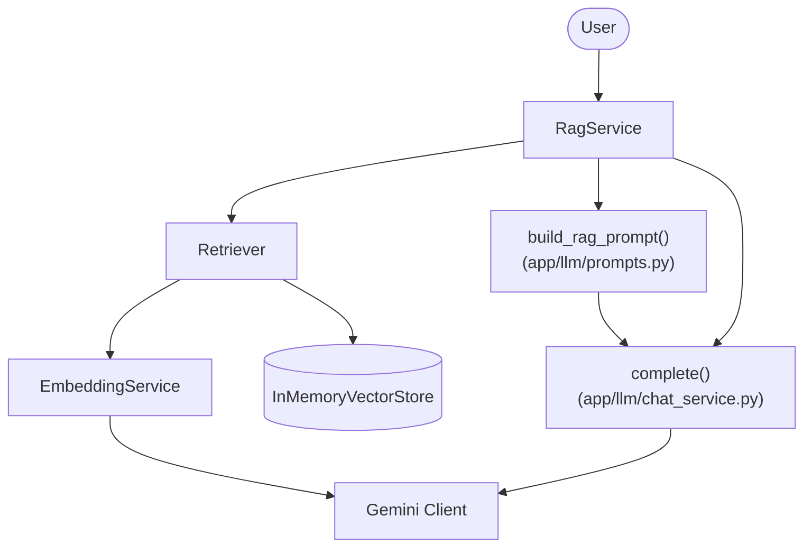
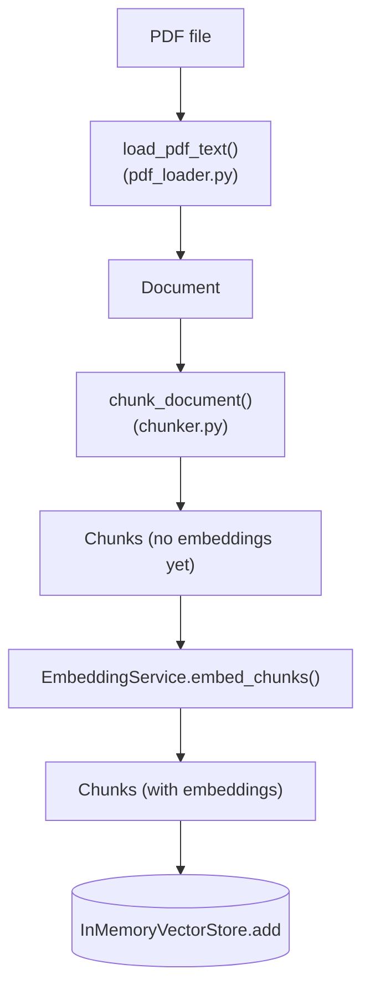

# Architecture

DocMind has two flows that matter: an **index-time** flow (turning a PDF into searchable, embedded chunks, run once per document) and a **query-time** flow (turning a user's question into a grounded, cited answer, run once per question). Most confusion about RAG systems comes from mixing these two up, so they're kept as separate diagrams here.

## Query-time flow: answering a question



Plain-text version, for anywhere Mermaid isn't rendered:

```
                    User
                      │
                      ▼
                 RagService
                      │
        ┌─────────────┼──────────────┐
        ▼             ▼              ▼
   Retriever    build_rag_prompt   complete()
        │             │              │
        ▼             └──────────────┤
 EmbeddingService                     ▼
        │                       Gemini Client
        ▼
   Vector Store
```

**Reading this diagram:** `RagService` is the orchestrator — it doesn't do retrieval, prompt-building, or generation itself, it just calls the three things that do and stitches the results together (see `app/retrieval/rag_service.py`). `Retriever` only ever produces `Chunk` objects; it has no import of, or reference to, Gemini generation at all — that's `chat_service.complete()`'s job, called separately by `RagService`. This split is what makes retrieval swappable (e.g. for hybrid search) without ever touching how answers get generated, and vice versa.

Note that `complete()` is a plain function in `chat_service.py`, not a method on the `ChatService` class used by the interactive terminal chat (`main.py`). They deliberately don't share state: `ChatService` keeps a running multi-turn conversation via `client.chats.create(...)`, while `complete()` is a one-shot, stateless call — a RAG prompt already carries its full context on every call, so it shouldn't also accumulate into a growing chat history.

## Index-time flow: ingesting a document



This whole flow is `app/ingestion/pipeline.py`'s `process_pdf(path)`, which returns `(document, chunks)` with every chunk's `.embedding` already populated. `scripts/test_rag.py` then does the one remaining manual step — `store.add(chunks)` — before handing the store to a `Retriever`.

## Why the split into layers

| Layer | Module(s) | Knows about | Doesn't know about |
|---|---|---|---|
| Client | `app/llm/client.py` | Gemini credentials, SDK | Chunks, chat history, prompts |
| Ingestion | `app/ingestion/` | PDFs, chunking | Embeddings, Gemini |
| Embedding | `app/embedding/` | Text → vectors, vector storage/search | PDFs, prompts, generation |
| Retrieval | `app/retrieval/` | Wiring retrieval + generation into an answer | How chunking or embedding work internally |
| Chat | `app/llm/chat_service.py` | Multi-turn conversation, one-shot completion | Retrieval, chunking |
| UI | `app/ui/console.py` | Terminal rendering | Everything above |

Each row can change without the others noticing, as long as the boundary (its public functions/classes) stays the same — e.g. `InMemoryVectorStore` can become a Chroma-backed store, and nothing in `app/retrieval/` has to change, because `Retriever` only calls `.add()` / `.search()`.

## Current limitations (see `README.md` → "What's next")

- The two flows above aren't connected to `main.py`'s interactive chat loop yet — there's no single running application, only test scripts that exercise the full pipeline.
- Retrieval is dense (embedding) search only; no keyword (BM25) matching or reranking yet, so a query with no genuinely relevant content still returns the least-bad chunks rather than none.
