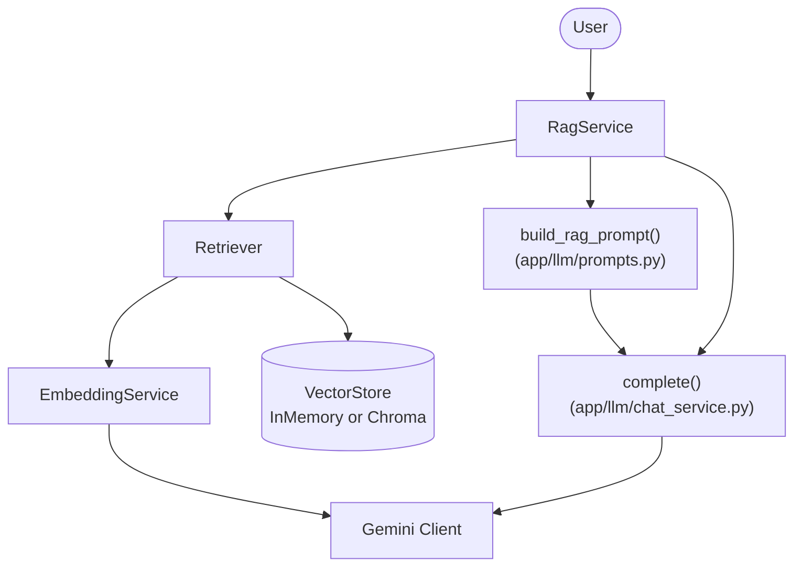
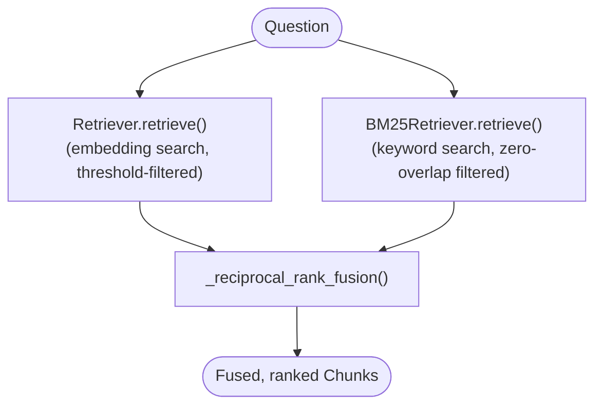
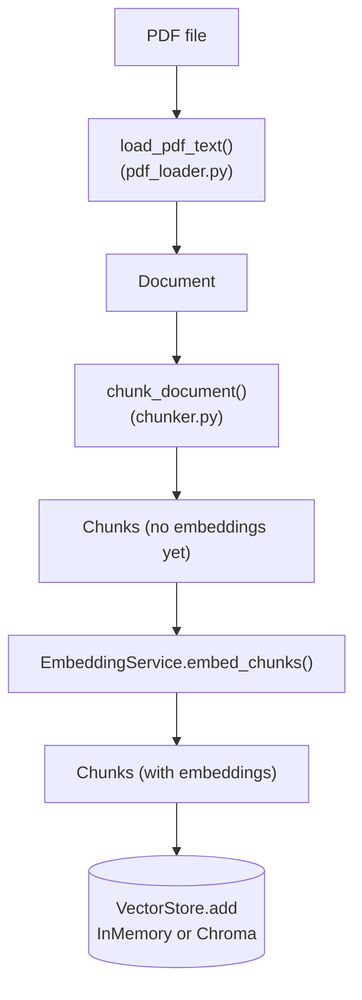

# Architecture

DocMind has two flows that matter: an **index-time** flow (turning a PDF into searchable, embedded chunks, run once per document) and a **query-time** flow (turning a user's question into a grounded, cited answer, run once per question). Most confusion about RAG systems comes from mixing these two up, so they're kept as separate diagrams here.

## Query-time flow: answering a question



Plain-text version, for anywhere Mermaid isn't rendered:

```
                    User
                      │
                      ▼
                 RagService
                      │
        ┌─────────────┼──────────────┐
        ▼             ▼              ▼
   Retriever    build_rag_prompt   complete()
        │             │              │
        ▼             └──────────────┤
 EmbeddingService                     ▼
        │                       Gemini Client
        ▼
   Vector Store
```

**Reading this diagram:** `RagService` is the orchestrator — it doesn't do retrieval, prompt-building, or generation itself, it just calls the three things that do and stitches the results together (see `app/retrieval/rag_service.py`). `Retriever` only ever produces `Chunk` objects; it has no import of, or reference to, Gemini generation at all — that's `chat_service.complete()`'s job, called separately by `RagService`. This split is what makes retrieval swappable (e.g. for hybrid search) without ever touching how answers get generated, and vice versa.

Note that `complete()` is a plain function in `chat_service.py`, not a method on the `ChatService` class used by the interactive terminal chat (`main.py`). They deliberately don't share state: `ChatService` keeps a running multi-turn conversation via `client.chats.create(...)`, while `complete()` is a one-shot, stateless call — a RAG prompt already carries its full context on every call, so it shouldn't also accumulate into a growing chat history.

"Retriever" in the diagram above is really "whatever `RagService` was constructed with that implements `retrieve(question, top_k) -> list[Chunk]`" — that's a plain `Retriever` (dense/embedding search only) or a `HybridRetriever` (dense + BM25 fused), interchangeably. See below for how the latter works internally.

## Hybrid retrieval: inside `HybridRetriever`



Both branches run independently and each applies its own relevance gate before fusion ever sees the candidates: `Retriever` drops anything below `SIMILARITY_THRESHOLD`, `BM25Retriever` drops anything with zero term overlap. Reciprocal Rank Fusion then merges the two (already-filtered) ranked lists by rank position, not raw score, since cosine similarity (0-1) and BM25 (unbounded, corpus-dependent) aren't on comparable scales. If both branches come back empty, `HybridRetriever` returns `[]` too — the "I don't know" guarantee from the similarity-threshold section holds for hybrid retrieval as well, it just now requires *both* signals to be silent rather than one.

This is also precisely the scenario hybrid retrieval was built for: a query like an exact library name might clear BM25's zero-overlap filter easily while failing dense search's similarity threshold (embeddings represent overall meaning, not exact strings) — in that case `Dense` contributes nothing, `BM25` contributes the match, and the fused result surfaces it anyway. `tests/test_hybrid_retriever.py::test_hybrid_retriever_falls_back_to_bm25_when_dense_finds_nothing` tests exactly this.

## Index-time flow: ingesting a document



This whole flow is `app/ingestion/pipeline.py`'s `process_pdf(path)`, which returns `(document, chunks)` with every chunk's `.embedding` already populated. Either store just needs `store.add(chunks)` after that — `scripts/test_rag.py` does this against a throwaway `InMemoryVectorStore`; `scripts/ingest.py` does the identical call against a persistent `ChromaVectorStore`.

## Why the split into layers

| Layer | Module(s) | Knows about | Doesn't know about |
|---|---|---|---|
| Client | `app/llm/client.py` | Gemini credentials, SDK | Chunks, chat history, prompts |
| Ingestion | `app/ingestion/` | PDFs, chunking | Embeddings, Gemini |
| Embedding | `app/embedding/` | Text → vectors, in-memory vector storage/search | PDFs, prompts, generation |
| Storage | `app/storage/chroma_store.py` | Persisting vectors to disk via Chroma | PDFs, prompts, generation (same boundary as Embedding's vector store) |
| Retrieval | `app/retrieval/` | Wiring retrieval + generation into an answer | How chunking, embedding, or storage work internally |
| Chat | `app/llm/chat_service.py` | Multi-turn conversation, one-shot completion | Retrieval, chunking |
| UI | `app/ui/console.py` | Terminal rendering | Everything above |

Each row can change without the others noticing, as long as the boundary (its public functions/classes) stays the same. This isn't hypothetical — it already happened: `InMemoryVectorStore` became swappable for `ChromaVectorStore` and nothing in `app/retrieval/` changed at all, because `Retriever` only ever calls `.add()` / `.search()` / `.search_with_scores()`, never anything specific to either implementation.

## Retrieval quality: the similarity threshold

`Retriever.retrieve()` now filters out chunks below `config.SIMILARITY_THRESHOLD` (default `0.70`) before they ever reach `RagService`:

```
Question
    │
    ▼
Embed + search (top-k, with scores)
    │
    ▼
Is best score >= SIMILARITY_THRESHOLD?
    │                          │
   YES                         NO
    │                          │
    ▼                          ▼
Return matching chunks    Return []  →  RagService's NOT_FOUND_MESSAGE
```

Before this, vector search always returned *something* — the top-k least-bad matches — even for a question with nothing relevant in the store (e.g. "who won the World Cup" against a document about RAG architecture). The fallback message relied entirely on the LLM following instructions. Now the retriever itself refuses to hand over context it isn't confident about, which is a stronger and cheaper guarantee than trusting the model to say "I don't know."

`Retriever` also logs the best score and how many candidates were rejected on every call (`app/retrieval/retriever.py`), and `scripts/test_search.py` prints per-chunk scores — both exist so the threshold can be calibrated empirically against real queries and documents rather than left at the default guess. **0.70 is a starting point, not a validated number** — cosine similarity score distributions vary by embedding model, so run a handful of genuinely relevant and genuinely irrelevant queries through `test_search.py` and look at where the scores actually separate before trusting it in production.

## Persistence: `ChromaVectorStore`

`app/storage/chroma_store.py` implements the same three-method interface as `InMemoryVectorStore` (`add`, `search`, `search_with_scores`) but backs it with an on-disk Chroma collection under `config.CHROMA_PERSIST_DIR`, so embeddings survive between process runs instead of being recomputed every time. Two details make the swap actually safe:

- Chroma's native distance metric for the collection is configured as cosine (`metadata={"hnsw:space": "cosine"}`), and `ChromaVectorStore` converts its returned distance back into the same 0-1 cosine-similarity scale (`similarity = 1 - distance`) that `SIMILARITY_THRESHOLD` and `InMemoryVectorStore.cosine_similarity()` already use — so `Retriever`'s threshold logic works identically regardless of which store it's holding.
- `chunk.id` is now deterministic (`f"{document.id}-{chunk_index}"`, with `document.id` a hash of the extracted text), so `collection.upsert()` overwrites in place on re-ingestion instead of duplicating rows every time a script runs.

`scripts/ingest.py` (embed + persist, run once per document) and `scripts/ask.py` (embed only the question, query the existing collection, answer) are the two-command version of "Load Chroma → Ready" — separating the expensive one-time cost from the cheap, repeatable one.

## Current limitations (see `README.md` → "What's next")

- The flows above aren't connected to `main.py`'s interactive chat loop yet — there's no single running application, only test scripts / `ingest.py` + `ask.py` that exercise the full pipeline.
- No reranking yet: hybrid retrieval (dense + BM25, RRF-fused) improves the candidate set, but nothing re-scores question+chunk pairs together the way a cross-encoder would — see README's "What's next" for what that adds.
- `BM25Retriever` rebuilds its keyword index from scratch on construction (`BM25Okapi([...])` over the whole corpus) — fine for the corpus sizes here, but unlike `ChromaVectorStore` it has no persistence of its own yet.
- The similarity threshold is a single global constant, not calibrated against real usage data — see the section above.
- `ChromaVectorStore.search()` doesn't return the chunk's embedding vector (Chroma isn't asked for it back, since nothing downstream needs it) — a real difference from `InMemoryVectorStore`, which happens to return the original in-memory object with its embedding intact. Don't rely on `chunk.embedding` being populated after any search.
